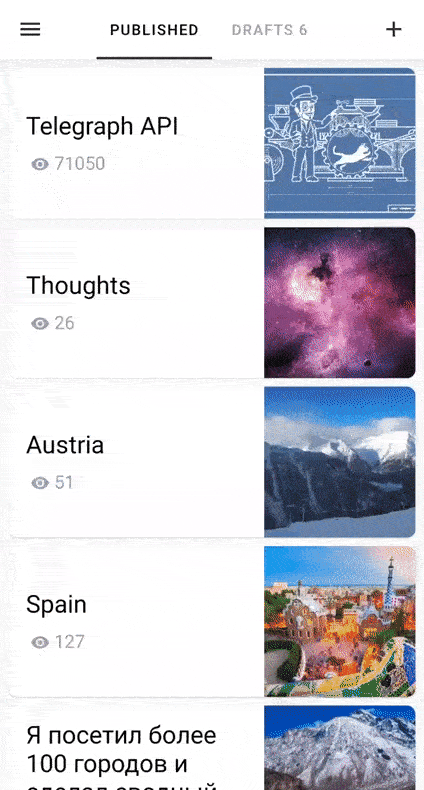
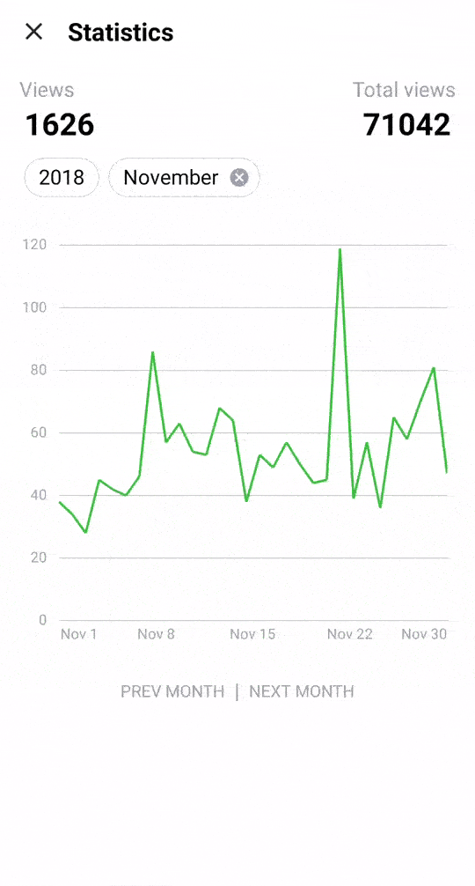

# Telegraph X
Telegraph X is Android client for Telegra.ph minimalist publishing tool (made by Telegram team) that allows you to create and manage publications. More information about Telegra.ph can be found [here](https://telegram.org/blog/telegraph).

**[Install on Google Play](https://play.google.com/store/apps/details?id=com.telex)**

## Main features:

* create / edit / delete publications

* auth and sync using [telegram bot](https://telegram.me/telegraph)

* rich building blocks like text, quote, heading, ordered/numbered list, image and etc.

* drafts with changes autosaving

* multiple accounts support

* publication views stats

* night mode

  
  
  

\
\
Join the [telegram channel](https://t.me/telegra_ph_x) and you’ll be aware of news, updates, changes and new features.

